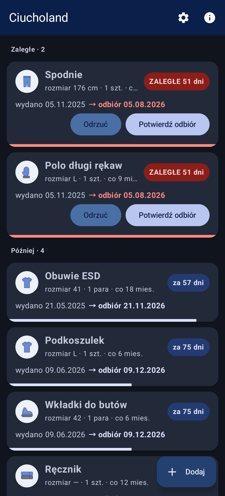

# Ciucholand

Aplikacja na Androida do pilnowania terminów odbioru odzieży roboczej. Dodajesz ubranie z datą
ostatniego wydania i przydziałem, a aplikacja przypomina o odbiorze,
prowadzi historię i pilnuje zaległości.

## Funkcje

- Wpisy: rodzaj, rozmiar, ilość i jednostka (szt. / para), przydział co ile miesięcy,
  data ostatniego wydania, historia odbiorów.
- Lista z sekcjami Zaległe / Wkrótce / Później, sortowana po najbliższym terminie.
- Karta wpisu: ikona typu ubrania, pigułka statusu (ZALEGŁE x dni / DZIŚ / za x dni),
  pasek postępu cyklu, data następnego odbioru.
- Potwierdzanie odbioru pojedynczo i masowo (zaznaczanie długim przyciśnięciem),
  odłożenie przypomnienia o 1-5 dni.
- Powiadomienia codziennie o wybranej godzinie (domyślnie 8:00), z akcjami
  "Odebrano" i "Odrzuć" prosto z powiadomienia. Przypomnienie przychodzi, dopóki
  odbiór nie zostanie potwierdzony.
- Ustawienia: ile dni przed terminem przypominać, o której godzinie, kopia danych
  (eksport / import JSON).
- Motyw jasny i ciemny.

## Wymagania

- Android 10 (API 29) lub nowszy, arm64-v8a.

## Dane

Wpisy są przechowywane lokalnie w SharedPreferences jako JSON - aplikacja nie wysyła
nic do internetu. Kopię zapasową zrobisz w Ustawieniach ("Zapisz do pliku") i wczytasz
przyciskiem "Wczytaj z pliku".

## Licencja

PolyForm Noncommercial License 1.0.0 - bezpłatnie do użytku prywatnego i niekomercyjnego.
Wykorzystanie komercyjne (w tym przez firmy i inne podmioty gospodarcze) wymaga pisemnej
zgody autora. Pełny tekst: [`LICENSE`](LICENSE).

## Autor

Artur Szafraniec
